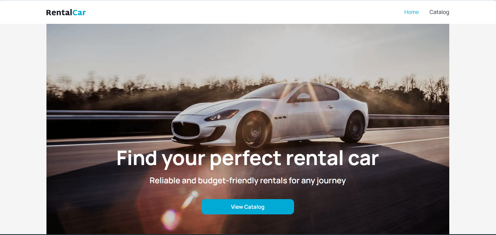
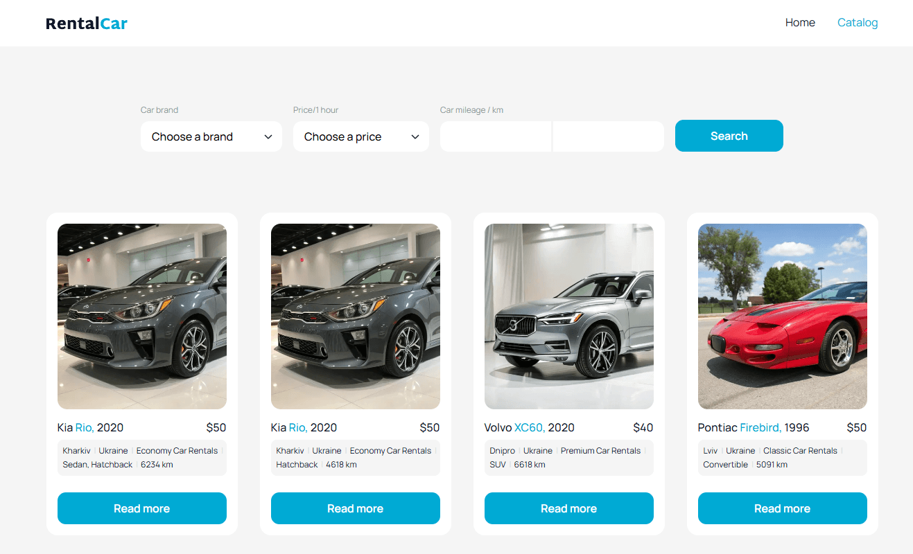
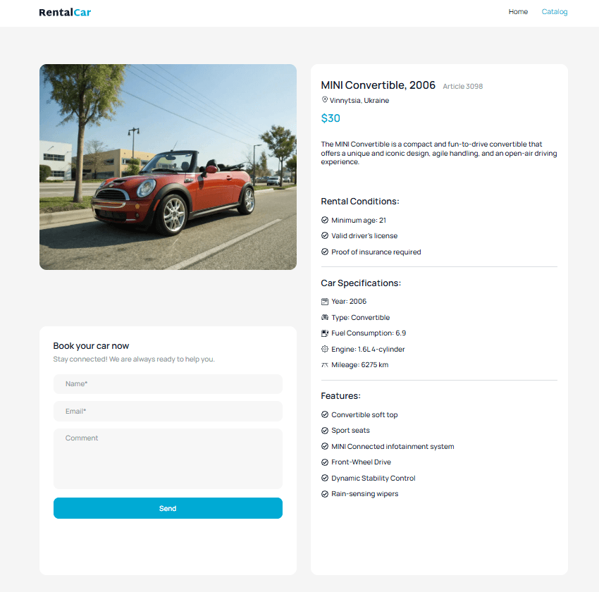

# Rental Car

Rental Car is a web application for browsing and booking rental cars. Users can
search available vehicles, filter cars by brand and price, view detailed
information, and submit booking requests.

**Live Demo:** [Rental Car](https://rental-car-theta-three.vercel.app)

## Screenshots

### Home page



### Car catalog



### Car details



## Features

- Browse a paginated list of available cars
- Search cars using filters
- Filter cars by brand, price, and mileage range
- View detailed information about a selected car
- Submit a car booking request
- Backend API integration with Axios and TanStack
- Form validation with Yup
- Loading and error notifications

## Technologies

- React 19
- TypeScript
- Next.js
- Axios
- TanStack Query
- Yup
- CSS
- ESLint

## Installation

Make sure that [Node.js](https://nodejs.org/) is installed.

1. Clone the repository:

   ```bash
   git clone [<repository-url>](https://github.com/Milosska/rental-car.git)
   ```

2. Navigate to the project directory:

   ```bash
   cd rental-car
   ```

3. Install dependencies:

   ```bash
   npm install
   ```

4. Create a `.env.local` file in the project root and add the backend URL:

   ```env
   NEXT_PUBLIC_BACKEND_BASE_URL=https://your-backend-url.com
   ```

## Running the Project

Start the development server:

```bash
npm run dev
```

Open the application in your browser:

```text
http://localhost:3000
```

## Available Scripts

- `npm run dev` — starts the development server
- `npm run build` — creates a production build
- `npm run start` — starts the production server
- `npm run lint` — checks the project for code issues

## API Integration

The application communicates with the backend using the following endpoints:

- `GET /cars` — retrieves a paginated list of cars
- `GET /cars/:id` — retrieves information about a specific car
- `GET /cars/filters` — retrieves available brands and price limits
- `POST /cars/:id/booking-requests` — submits a booking request

The API base URL is configured with the `NEXT_PUBLIC_BACKEND_BASE_URL`
environment variable.

## Project Structure

```text
rental-car/
├── public/              # Static assets
├── src/
│   ├── app/              # Application pages and layouts
│   ├── components/       # Reusable UI components
│   ├── lib/
│   │   ├── api/          # API requests
│   │   └── types/        # TypeScript types
│   └── styles/           # Application styles
├── .env.local            # Local environment variables
├── package.json
└── README.md
```

## Author

**Milosska**

- GitHub: [Milosska](https://github.com/Milosska)

## License

This project was created for educational purposes.
